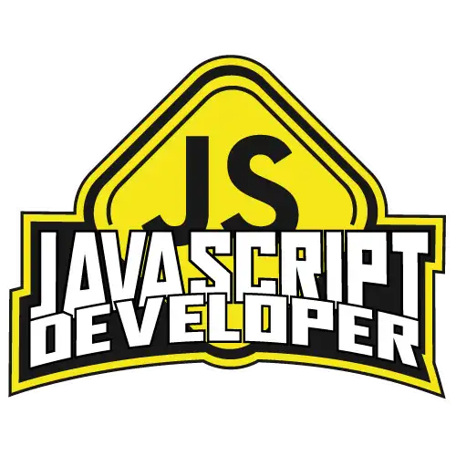

    

-------
## Formação JavaScript Developer | Digital innovation one 

Aprenda JavaScript do zero, em uma abordagem de ensino totalmente imersiva e prática. Nesta formação você aprenderá desde os fundamentos desta linguagem de programação até o seu papel essencial na Web atualmente. Para isso, traremos uma dinâmica diferente de tudo o que você já viu, onde o expert conduz todo o primeiro módulo usando a técnica de "pair programming", ensinando o JavaScript do zero para um profissional em transição de carreira. Nos dois módulos seguintes, você dominará os conceitos necessários para utilizar o JavaScript na Web, com ênfase no consumo de APIs, convenções e boas práticas. Por fim, para fechar a sua jornada com chave de ouro, você criará seu próprio currículo online com a identidade visual da DIO. Pré-requisitos: Nenhuma, mas Lógica de Programação e Pensamento Computacional são sempre bem-vindos. Boooora!? 

## ✨Desafios

    
<strong>Aprenda a Programar</strong>

     
    

        <table border=1>
            <tr>
                <th colspan="3"><a href="">01_Primeiros Passos JavaScipt</a></th>
            </tr>
            <tr>
                <th>Desafio</th>
                <th>Solução</th>
                <th>Status</th>
            </tr>
            <tr>
                <td>Desafio_Valor de uma viagem</td>
                <td><a href="">Código</a></td>
                <td align="center">✔️</td>
            </tr> 
            <tr>
                <td>Desafio_Valor de uma viagem com tipo de combustivel</td>
                <td><a href="">Código</a></td>
                <td align="center">✔️</td>
            </tr> 
            <tr>
                <td>Desafio_Valor da media do aluno</td>
                <td><a href="">Código</a></td>
                <td align="center">✔️</td>
            </tr> 
            <tr>
                <td>Desafio_Calcular IMC</td>
                <td><a href="">Código</a></td>
                <td align="center">✔️</td>
            </tr>      
            <tr>
                <td>Desafio_Calcular Desconto</td>
                <td><a href="">Código</a></td>
                <td align="center">✔️</td>
            </tr>   
            <tr>
                <th colspan="3"><a href="">02_Conhecendo Funções</a></th>
            </tr>                     
            <tr>
                <td>Poder Função</td>
                <td><a href="">Código</a></td>
                <td align="center">✔️</td>
            </tr>
            <tr>
                <td>Desafio_Classificar IMC</td>
                <td><a href="">Código</a></td>
                <td align="center">✔️</td>
            </tr>
            <tr>
                <td>Desafio_Verificar Idade</td>
                <td><a href="">Código</a></td>
                <td align="center">✔️</td>
            </tr>
            <tr>
                <td>Desafio_Aplicar Desconto</td>
                <td><a href="">Código</a></td>
                <td align="center">✔️</td>
            </tr>   
            <tr>
                <th colspan="3"><a href="">03_Objetos e Classes</a></th>
            </tr>  
            <tr>
                <td>Desafio_Carros</td>
                <td><a href="">Código</a></td>
                <td align="center">✔️</td>
            </tr>   
            <tr>
                <td>Desafio_IMC</td>
                <td><a href="">Código</a></td>
                <td align="center">✔️</td>
            </tr>                 
        </table>  
    

## 💻 Tecnologias
- HTML
- CSS
- JavaScript

## 💬 Assuntos abordados

- JavaScript
    - Introdução ao JavaScript

## 🎓 Instrutor
 - Renan Johannsen

## 📜 License

O projeto lançado em 2023 sobre a licença [MIT](./LICENSE) ❤️ 

Made with ♥ by Anmorhy

Gostou? Deixe uma estrelinha ⭐
